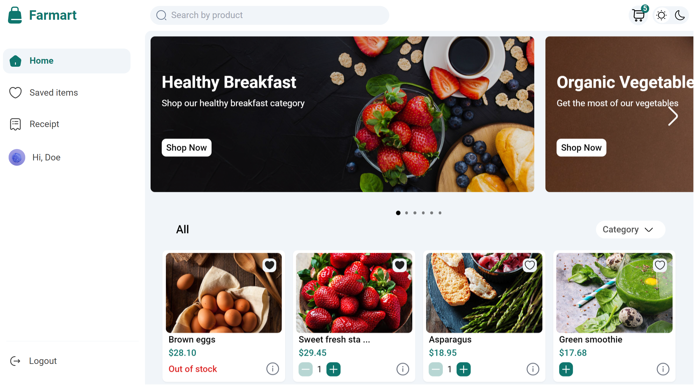

# Farmart

## Table of contents

- [Introduction](#introduction)
- [Demo](#demo)
- [Run](#run)
- [Technology](#technology)
- [Features](#features)
- [Database Models](#database)
- [Color Palette](#colors)
- [License](#license)

## Introduction

A virtual ecommerce website with admin page using Next.js, Node js, Express js, and Mongoose.

## Demo

### Client home page




### Admin dashboard page


The client and admin application is deployed to netlify and can be accessed through the following link:

[Farmart Client on Netlify](https://farmart-client.netlify.app)

[Farmart Admin on Netlify](https://farmart-admin.netlify.app)

The website resembles a real store and you can add products to your cart and pay for them. If you want to try the checkout process, you can use the dummy card number provided by stripe for testing which is 4242 4242 4242 4242 with any expiration date, CVC, and zip codes. Please <u><b>DO NOT</b></u> provide real card number and data.

## Run

To run this application, you have to set your own environmental variables. For security reasons, some variables have been hidden from view and used as environmental variables with the help of dotenv package. Below are the variables that you need to set in order to run the application:

Server env variables

- MONGODB_URI: this is the connection string of your MongoDB Atlas database for server.

- SESSION_KEY: a secret message for the session. You can use any string here for server.

- STRIPE_PRIVATE_KEY: the stripe package is used to process payment in the checkout route. To get this, you should set up a stripe account and put your private API key here. For client.

- STMP_EMAIL, STMP_PASSWORD: the email and password given to nodemailer to send/receive the email. Please put a real email and password here because you will receive the messages sent from the contact us form on this email. Gmail recommended. For server.

- JWT_KEY: a secret message for the sign jwt. You can use any string here. For server.

- EXPIRESIN: jwt expiration time in string default will be 7 days. For server

- SALTROUNDS: bcrypt salt round use 12. For server

- CLIENT_URL: client URL. For server

- ADMIN_URL: admin URl. For server

- PORT: server port. For server

- STORAGE_CREDENTIALS_PATH: path to google cloud storage credentials file

- STORAGE_BUCKET_NAME: google cloud storage bucket name

- STORAGE_PROJECT_ID: google cloud storage project id

Client env variables

- NEXT_PUBLIC_STRIPE_PUBLISHABLE_KEY: the stripe package is used to process payment in the checkout route. To get this, you should set up a stripe account and put your publishable key here.

- STRIPE_SECRET_KEY: the stripe package is used to process payment in the checkout route. To get this, you should set up a stripe account and put your secret key here.

- STRIPE_SIGNING_SECRET: the stripe package is used to process payment in the checkout route. To get this, you should set up a stripe account and put your signing secret.

- SERVER_URL: enter your server url here.

Admin env variables

- SERVER_URL: enter your server url here.

Now you can run app in the terminal.

```bash
# for client
npm run dev
# for admin
npm run dev
# for server
npm run dev
```

## Technology

The application is built with:

- Node.js version (v18.12.1).
- Express version (v4.18.1).
- Express-GraphQL (v0.12.0).
- GraphQL (v15.8.0).
- Graphql-Upload-Minimal (v1.5.4): for images upload through graphql api.
- MongoDB version (v4.12.0).
- Google Cloud Storage (v6.6.0): for hosting images.
- Connect mongo (v4.6.0): for storing session in mongodb
- Nodemailer (v6.8.0): used to send emails from the contact us form

## Features

The application displays a virtual bags store that contains virtual products and contact information.

Users can do the following:

- Create an account, login or logout, forget password, change password, modifying info.
- Add and remove products to favorite.
- Product search
- Browse available products added by the admin
- Add, modify and Delete products from the shopping cart
- Display the shopping cart
- To checkout, a user must be logged in
- Checkout information is processed using stripe and the payment is send to the admin
- View Orders History


Admins can do the following:

- Create an account, login or logout, forget password, change password, modifying info.
- 3 level of admin access, Gold, Sliver, Bronze.
- Creating, modifying and deleting products (Gold and Sliver only).
- Creating and deleting categories (Gold and Sliver only).
- Creating, modifying and deleting banners (Gold and Sliver only).
- Applying coupon to a user (Gold and Sliver only).
- Sending inbox to a user.
- Blocking user which will prevent them from accessing there account (Gold only).
- Sending admin invite (Gold only).

## Database

All the models can be found in the server/models directory created using mongoose.

### User Schema:

- name (String)
- email (String)
- password (String)
- photoUrl (String)
- gender (String)
- birthday (Date)
- phoneNumber (String)
- addresses (Array): <br />
  ~ name (String) <br />
  ~ street (String) <br />
  ~ city (String) <br />
  ~ state (String) <br />
  ~ country (String) <br />
  ~ info (String) <br />
  ~ phoneNumber (String) <br />
  ~ phoneNumber2 (String) <br />
  ~ default (String) <br />
- blocked (Boolean)

### Employee Schema:

- name (String)
- email (String)
- password (String)
- photoUrl (String)
- gender (String)
- birthday (Date)
- phoneNumber (String)
- level (String)

### Products Schema:

- title (String)
- slug (String)
- category (String)
- description (String)
- image: <br />
  ~ name <br />
  ~ url <br />
- stock (Number)
- rating (Array): <br />
  ~ name (String) <br />
  ~ value (Number) <br />
- discount (String)
- currency (Object): <br />
  ~ name (String) <br />
  ~ symbol (String) <br />
  ~ symbolNative (String) <br />
  ~ decimalDigits (Number) <br />
  ~ rounding (Number) <br />
  ~ code (String) <br />
  ~ namePlural (String) <br />
- reviews (Array): <br />
  ~ name (String) <br />
  ~ title (String) <br />
  ~ message (String) <br />
  ~ rating (String) <br />
  ~ userId (String) <br />

### Banners Schema:

- title (String)
- description (String)
- image (String)
- link (String)

### Categories Schema:

- name (String)

### Coupon Schema:

- email (String)
- code (String)
- discount (Number)
- description (String)
- userId (String)
- expiresIn (String)

### Favorite Schema:

- userId (String)
- data (Array of String)

### Inbox Schema:

- title (String)
- description (String)
- userId (String)

### Order Schema:

- userId (String)
- totalPrice (String)
- orderId (String)
- status (String)
- paymentMethod (String)
- deliveryMethod (String)
- address: <br />
  ~ name (String) <br />
  ~ street (String) <br />
  ~ city (String) <br />
  ~ state (String) <br />
  ~ country (String) <br />
  ~ info (String) <br />
  ~ phoneNumber (String) <br />
  ~ phoneNumber2 (String) <br />
  ~ default (String) <br />
- products (Array): <br />
  ~ id (String) <br />
  ~ price (String) <br />
  ~ quantity (String) <br />
- pickup (String)
- trackingId (String)
- paymentId (String)
- progess (Array): <br />
  ~ name (String) <br />
  ~ checked (Boolean) <br />
- shippingFee (String)
- coupon: <br />
  ~ id (String) <br />
  ~ email (String) <br />
  ~ discount (Number) <br />
  ~ description (String) <br />
  ~ userId (String) <br />
  ~ expiresIn (Date) <br />
  ~ code (String) <br />
- phoneNumber (String)

### Validate Schema:

- name (String)
- email (String)
- validationToken (String)
- expiresIn (Date)

## License

[](http://badges.mit-license.org)

- MIT License
- Copyright 2022 © [Nunu Olamilekan](https://github.com/olamilekan21)
