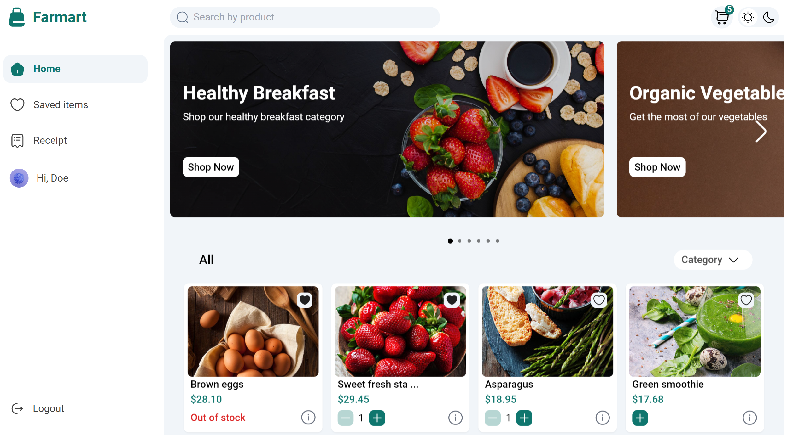
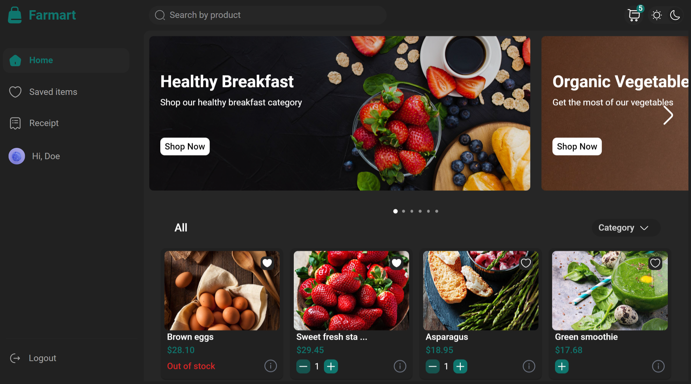
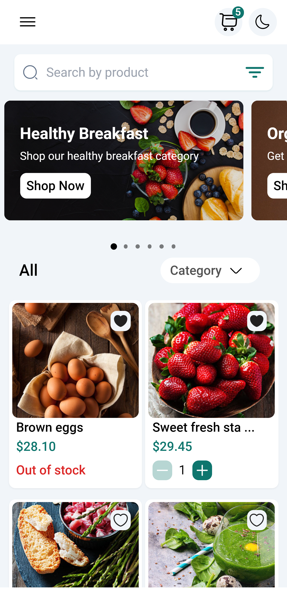
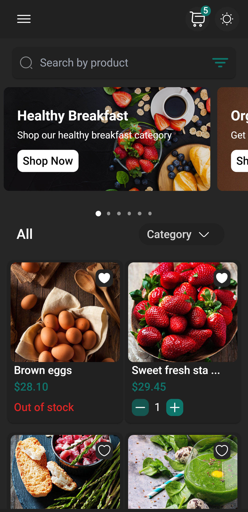

# Farmart Client

## Table of contents

- [Introduction](#introduction)
- [Run](#run)
- [Technology](#technology)
- [Features](#features)
- [License](#license)

## Introduction

A virtual ecommerce website created with next.js.

## Demo

### Client

The website resembles a real store and you can add products to your cart and pay for them. If you want to try the checkout process, you can use the dummy card number provided by stripe for testing which is 4242 4242 4242 4242 with any expiration date, CVC, and zip codes. Please <u><b>DO NOT</b></u> provide real card number and data.

## Run

To run this application, you have to set your own environmental variables. For security reasons, some variables have been hidden from view and used as environmental variables with the help of dotenv package. Below are the variables that you need to set in order to run the application:

- NEXT_PUBLIC_STRIPE_PUBLISHABLE_KEY: the stripe package is used to process payment in the checkout route. To get this, you should set up a stripe account and put your publishable key here.

- STRIPE_SECRET_KEY: the stripe package is used to process payment in the checkout route. To get this, you should set up a stripe account and put your secret key here.

- STRIPE_SIGNING_SECRET: the stripe package is used to process payment in the checkout route. To get this, you should set up a stripe account and put your signing secret.

- SERVER_URL: enter your server url here.

Now you can run `npm run dev` in the terminal and the application should work.

## Technology

The application is built with:

- Next.js (v18.12.1).
- React (18.1.0)
- Apollo Client (3.6.9): for sending requests to the server
- Apollo upload client (17.0.0): for send image to the server
- GraphQL (v15.8.0).
- Iconsax react (0.0.8).
- Stripe: used for payment in the checkout page

## Features

The application displays a virtual bags store that contains virtual products and contact information.

- Create an account, login or logout, forget password, change password, modifying info.
- Add and remove products to favorite.
- Product search
- Browse available products added by the admin
- Add, modify and Delete products from the shopping cart
- Display the shopping cart
- To checkout, a user must be logged in
- Checkout information is processed using stripe and the payment is send to the admin
- View Orders History

## License

- MIT License
- Copyright 2022 © [Nunu Olamilekan](https://github.com/olamilekan21)